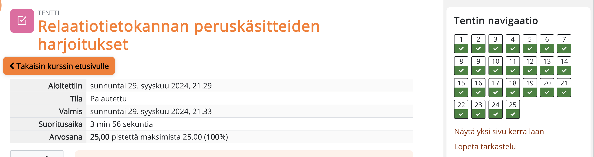
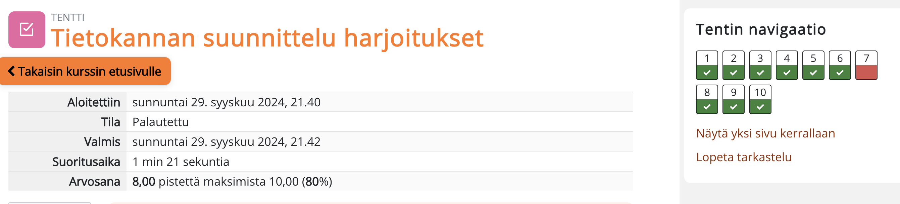

# Viikko 1 - Tehtävät

# Viikko 2 - Tehtävät

### Tehtävä 1
SELECT id, name, description, icon, target, target_minvalue, target_maxvalue, target_text FROM goal;'

### Tehtävä 2
SELECT name, type FROM airport WHERE iso_country = 'FI';

### Tehtävä 3
SELECT name FROM airport WHERE iso_country = 'FI' ORDER BY name ASC;

## Tehtävä 4 
SELECT name, type FROM airport WHERE iso_country = 'FI' ORDER BY type, name;

### Tehtävä 5
SELECT name FROM country WHERE name Like 'F%*;

### Tehtävä 6
SELECT name FROM country WHERE name LIKE '%F%';

### Tehtävä 7
SELECT location FROM game WHERE screen_name = 'Vesa';

### Tehtävä 8
SELECT co2_consumed FROM game WHERE screen_name = 'ilkka';

### Tehtävä 9
SELECT co2_budget FROM game LIMIT 1;

# Viikko 2 Where liitososan tehtävät

### Tehtävä 1
SELECT country.name AS "country name", airport.name AS "airport name" FROM country JOIN airport ON country.iso_country = airport.iso_country WHERE country.name = 'iceland' ORDER BY airport.name;

### Tehtävä 2
SELECT airport.name AS "airport name" FROM country JOIN airport ON counrty.iso_country = airport.iso_country WHERE country.name = 'France' AND airport.type = 'large_airport' ORDER BY airport.name;

### Tehtävä 3
SELECT country.name AS "country_name", airport.name AS "airport_name" FROM airport, country WHERE country.continent like 'AN' AND airport.iso_country LIKE country.iso_country

### Tehtävä 4
SELECT elevation_ft FROM airport, game WHERE game.screen_name LIKE 'Heini' AND game.location LIKE airport.ident;

### Tehtävä 5
SELECT (elevation_ft * 0.3048) AS elevation_m FROM airport, game WHERE game.screen_name LIKE 'Heini' AND game.location LIKE airport.ident;

SELECT (elevation_ft * 0.3048) AS elevation_m FROM airport, game WHERE game.screen_name LIKE 'Heini' AND game.location LIKE airport.ident;

### Tehtävä 6
SELECT name FROM airport, game WHERE game.screen_name LIKE 'Ilkka' AND game.location LIKE airport.ident ;

### Tehtävä 7
SELECT c.name -> FROM game g -> JOIN airport a ON g.location = a.ident -> JOIN country c ON a.iso_country = c.iso_country -> WHERE g.screen_name = 'Ilkka';

### Tehtävä 8
SELECT name FROM goal, goal_reached, game WHERE game.screen_name LIKE 'heini' AND game.id = game_id and goal.id=goal_id;

### Tehtävä 9
SELECT airport.name FROM airport, game, goal, goal_reached WHERE game.screen_name LIKE 'Ilkka' AND game.id = goal_reached.game_id AND goal.name LIKE 'CLOUDS' AND goal_reached.goal_id = goal.id AND game.location = airport.ident;

### Tehtävä 10
select country.name -> from country, goal, goal_reached, airport, game -> where game.screen_name = "Ilkka" AND goal.name = 'CLOUDS' AND game.id = goal_reached.game_id and goal_reached.goal_id = goal.id and game.location = airport.ident AND airport.iso_country = country.iso_country;

# Viikko 5

